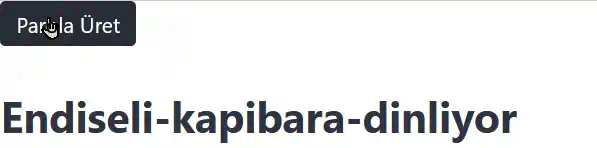
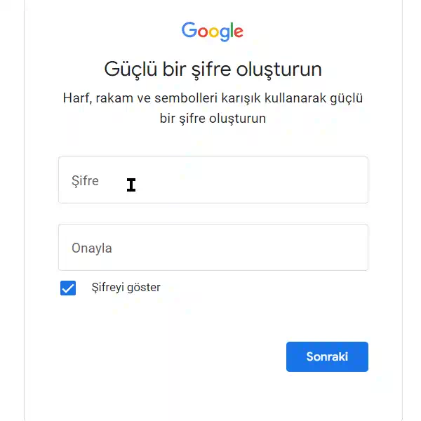
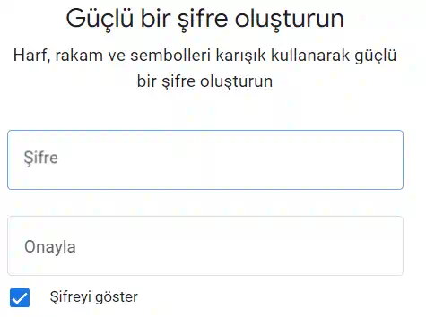
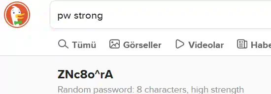

# Ezberlenen Parola

🔑 Generate Turkish Password Sentences

[](https://packagephobia.com/result?p=ezberlenen-parola)   

## Güvenli ve kullanımı kolay unutulmayan şifreler oluşturun

Bu araç, Türkçe'de kolay hatırlanabilen cümlelerden yola çıkarak çok güvenli şifreler oluşturmanıza olanak tanır.



### Sıradan Örnekler

#### Galatasaray



**Uyarı**: Bu çok yaygın bir paroladır.

Türkiye'deki erkeklerin tuttukları takımları parola olarak kullanma alışkanlığı vardır. **Bu çok kötü bir fikirdir.**

**Güç puanı (1-5)**: 1

---

#### G4l4t4s4r4y



##### Kırılması için gereken süre

- saatte 100 deneme: 8 gün
- saniyede 10 deneme: 34 dakika
- saniyede 10 bin deneme: 2 saniye
- saniyede 10 milyar deneme: bir saniyeden az

**Güç puanı (1-5)**: 2

---

#### 64l4t454r4y

daha fazla sayı koymanız sonucu değiştirmiyor.

**Güç puanı (1-5)**: 2

---

#### 6Sc3ecnZ

Belki de daha karışık olması için bir şifre üretici kullanmanın iyi bir fikir olduğunu düşünüyorsunuz.

##### 6Sc3ecnZ parolasının Kırılması için gereken süre

- saatte 100 deneme: yüzyıllar
- saniyede 10 deneme: 4 ay
- saniyede 10 bin deneme: 3 saat
- saniyede 10 milyar deneme: bir saniyeden az

**Güç puanı (1-5)**: 3

#### XPH7S@Vq

noktalama işaretleri eklesiniz bile sonuç değişmeyecek



**Güç puanı (1-5)**: 3

##### "XPH7S@Vq" Kırılması için gereken süre

- saatte 100 deneme: yüzyıllar
- saniyede 10 deneme: 4 ay
- saniyede 10 bin deneme: 3 saat
- saniyede 10 milyar deneme: bir saniyeden az

### Ezberlenen Parola Örnekleri

Kaba kuvvet (bruteforce) ve Sözlük saldırıları ile kırılması neredeyse imkânsızdır.

Not almaya gerek kalmaz. **Ezlerlenmesi kolaydır!**

#### Gergin-deniz-aslani-gidiyor

Sadece "gergin" bir "deniz aslanının" nasıl "gideceğini" hayal edin. Aklınıza yerleşecek.


**Güç puanı (1-5)**: 5

##### "Gergin-deniz-aslani-gidiyor" parolasının Kırılması için gereken süre

- saatte 100 deneme: yüzyıllar
- saniyede 10 deneme: yüzyıllar
- saniyede 10 bin deneme: yüzyıllar
- saniyede 10 milyar deneme: yüzyıllar

Ayrıca Ezberlenen Parola'yı  kolaylıkla ezberleyebilirsiniz.

[Gergin Deniz Aslanı](https://www.youtube.com/watch?v=owkdOWdEMU8)

#### Şaşkın geyik gezecek

Eğer şifre alanı türkçe karakterlere izin veriyorsa Ezberlenen Parola'nın kırılması olanaksızdır.


**Güç puanı (1-5)**: 5

##### "Şaşkın geyik gezecek" Kırılması için gereken süre

- saatte 100 deneme: yüzyıllar
- saniyede 10 deneme: yüzyıllar
- saniyede 10 bin deneme: yüzyıllar
- saniyede 10 milyar deneme: yüzyıllar

#### Düzensiz mavi alakarga i̇zleyecek

 veya uluslar-arası uyumlu

#### Sadik-gunes-baligi-ve-kapsamli-guvercin-gitti

gibi cümleler, hem hatırlaması kolay hem de kırılması zor şifreler oluşturmanızı sağlar.

Bu yöntem, şifrelerinizi hem güvenli tutmanıza hem de kolayca hatırlamanıza yardımcı olur.

## Lisans

[LGPL-3.0](http://www.gnu.org/licenses/lgpl.html)

## Özellikler

- Kelime sayısı belirleme
- Türkçe karakter kaldırma
- Aralık belirleme
- Tüm tarayıcılar ve Node.js için kolay uygulama
- **TypeScript Desteği**
- TypeScript Tip Tanımları için ES Modül Desteği:
 .d.mts uzantısı, TypeScript'in ES modül sistemini kullanan JavaScript dosyaları için tip tanımlarını içerir. Bu, TypeScript projelerinde modül bazlı geliştirmeyi kolaylaştırır ve tip güvenliğini artırır.

**Modüler Tip Tanımları**: anlaşılır hiç bir tip bilgisi girmeden tüm tip bilgileri gelir.

## Kullanım/Örnekler

```javascript
import { parolaUret } from "ezberlenen-parola";

const guvenliParola = parolaUret() ;

const secenekler = { kelimeSayisi: 5, standart: true, araliklar: "-" };
const ozelParola = parolaUret(secenekler);


```

### Örnek Parolalar

- Zarif tavuk çalışmalıydı
( sadece kibar bir tavuğun çalışması gerektiğini hayal edin)
- Meraklı solucan gidiyor
 ( merak içinde gezinen bir solucan hayal edin)

### Özelleştirilmiş Parolalar

`const secenekler = { kelimeSayisi: 5, standart: true, araliklar: "-" };`

- Guzel-horoz-ve-akilli-pangolin-calisacak

## Belgeler

[Üretilen Şifrelerin Kalitesini kontrol edebileceğiniz Test Platformu](<https://www.bennish.net/password-strength-checker/>)

## Neden daha güvenli?


